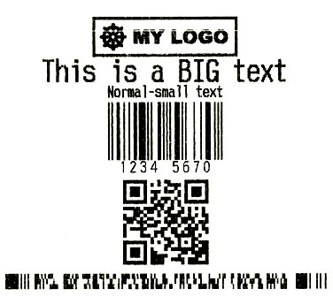

# JSESCPOSBuilder - ESC/POS Commands Builder for Javascript

**Generates EPSON ESC/POS-compatible commands from Javascript!** Support most ESC/POS commands for printing **Images** (Logos, Symbols, etc), 
**Texts** (Normal, Bold, Italic, Alignment, etc), **Linear/1D Barcodes** (like Code 39, Code 128, EAN-UPC, etc), **2D Barcodes** (like QR Code, PDF417), and
special commands like **paper cut, cashdraw, beep, and feed.**
 
To **print/send** the generated **ESC/POS** commands from a **website/page/view _(written by using any web framework like React, Angular, Vue, ASP.NET, PHP, Django, etc)_ to the client printer** you can use the [**JSPrintManager**](https://github.com/neodynamic/JSPrintManager) solution.

Project code is available in **Typescript** and plain **Javascript** code.

## Credits
Most of the code of this project was based on the [https://github.com/escpos/node-escpos](https://github.com/escpos/node-escpos) and [https://github.com/mike42/escpos-php](https://github.com/mike42/escpos-php) projects

## Licenses

- The **JSESCPOSBuilder** code is licensed under **MIT License** 

- The [**JSPrintManager**](https://www.neodynamic.com/products/printing/js-print-manager) solution is a [**Commercial product licensed under these terms**](https://neodynamic.com/eula)

## Dependencies

- [https://github.com/SheetJS/js-codepage](https://github.com/SheetJS/js-codepage)

## Example: How to generate ESC/POS commands and print them through [**JSPrintManager**](https://www.neodynamic.com/products/printing/js-print-manager)



```html
<!DOCTYPE html>
<html>
<head>
    <title>Advanced ESC/POS Printing from Javascript</title>
    <meta charset="utf-8" />
</head>
<body>

    <div style="text-align:center">
        <h1>Advanced ESC/POS Printing from Javascript</h1>
        <hr />
        <label class="checkbox">
            <input type="checkbox" id="useDefaultPrinter" /> <strong>Print to Default printer</strong>
        </label>
        <p>or...</p>
        <div id="installedPrinters">
            <label for="printerName">Select an installed Printer:</label>
            <select name="printerName" id="printerName"></select>
        </div>
        <br /><br />
        <button type="button" onclick="doPrinting();">Print Now...</button>
    </div>

    <script src="https://cdnjs.cloudflare.com/ajax/libs/bluebird/3.3.5/bluebird.min.js"></script>
    <script src="https://code.jquery.com/jquery-3.2.1.slim.min.js"></script>

    <!--IMPORTANT: BE SURE YOU HONOR THIS JS LOAD ORDER-->
    <script src="https://jsprintmanager.azurewebsites.net/scripts/cptable.js"></script>
    <script src="https://jsprintmanager.azurewebsites.net/scripts/cputils.js"></script>
    <script src="https://jsprintmanager.azurewebsites.net/scripts/JSESCPOSBuilder.js"></script>
    <script src="https://jsprintmanager.azurewebsites.net/scripts/JSPrintManager.js"></script>
    <script src="https://jsprintmanager.azurewebsites.net/scripts/zip.js"></script>
    <script src="https://jsprintmanager.azurewebsites.net/scripts/zip-ext.js"></script>
    <script src="https://jsprintmanager.azurewebsites.net/scripts/deflate.js"></script>

    <script>

        var clientPrinters = null;
        var _this = this;

        //WebSocket settings
        JSPM.JSPrintManager.auto_reconnect = true;
        JSPM.JSPrintManager.start();
        JSPM.JSPrintManager.WS.onStatusChanged = function () {
            if (jspmWSStatus()) {
                //get client installed printers
                JSPM.JSPrintManager.getPrinters().then(function (printersList) {
                    clientPrinters = printersList;
                    var options = '';
                    for (var i = 0; i < clientPrinters.length; i++) {
                        options += '<option>' + clientPrinters[i] + '</option>';
                    }
                    $('#printerName').html(options);
                });
            }
        };

        //Check JSPM WebSocket status
        function jspmWSStatus() {
            if (JSPM.JSPrintManager.websocket_status == JSPM.WSStatus.Open)
                return true;
            else if (JSPM.JSPrintManager.websocket_status == JSPM.WSStatus.Closed) {
                console.warn('JSPrintManager (JSPM) is not installed or not running! Download JSPM Client App from https://neodynamic.com/downloads/jspm');
                return false;
            }
            else if (JSPM.JSPrintManager.websocket_status == JSPM.WSStatus.Blocked) {
                alert('JSPM has blocked this website!');
                return false;
            }
        }

        //Do printing...
        function doPrinting() {
            if (jspmWSStatus()) {

                // Gen sample label featuring logo/image, barcode, QRCode, text, etc by using JSESCPOSBuilder.js

                var escpos = Neodynamic.JSESCPOSBuilder;
                var doc = new escpos.Document();
                escpos.ESCPOSImage.load('data:image/png;base64,iVBORw0KGgoAAAANSUhEUgAAAP8AAABFCAIAAAAKO6eOAAAAAXNSR0IArs4c6QAAAARnQU1BAACxjwv8YQUAAAAJcEhZcwAADsMAAA7DAcdvqGQAAAd5SURBVHhe7Z1RgqM4DETnXDkQ58lpcpkcZteGAmxLJcvB0+ll9b56SFnIchmMQ0//CYIgCIIgCIIgCIL/Df8EwX2ByxlQBcEdgcsZUAXBHYHLGVAFwR2ByxlQBcEdgcsZUAXBHYHLGVBN5/1cHtsZHs83jgXBD7NZkALVbF4L4mfC/8GXgAMZUE3m/cSFfyXcH3wJOJAB1XSKi3+YP/gWsCADqpm836/X67kc6/7l+UwH3jEFgh9nsyAFquskzy+Pcr2jkqbCK6ZB8FPAdgyoXGR/r42ShwsLv9OFvmv7msdS3Qv2uLFICuay2YoClYdqH2d55UPJ+IO+L8hTYA1Sxgj/BxOBqxhQORD7OPWBz8gzoJpVmFZBMAOYigGVh9qlnEdaGFVLofXfzpkS1/5gInAVAyoX5/e3Oudqnuz3dx+MU4RNGQQzgK8YUA2gLXjEVk4pai/nx8NzRfg+mA/MxYDKjb78kdds69sucg+5uugxn0O0yWU12JMhyz0j1/EWNWr7S9eG9+uZl57NbTcfWPJVa7zqa8AcEaFO1qDP4V3t6RnuIBIDKidkZBP14JKVz4rhObdDVEz3K6Gd+jE3X/X+VPe796L37bce7oAJV8zpGTagNQMqF9z7K4/HOecrZ51D13tyuHSNM92s+M/sTiknQiVXksJQrya5X19fWvRm6HDATsj5GUrQkAGVAzGyy0umf+RXjKF2DKT5IqNu4nFs94vApvmbQvv8P8P75FyDMTqloHB72dUyIJnPz1AFrRhQ9WnT3XvVzODtBlCLc8biFpcObv1ggYfpFbQO3FG3Ve77nwQc7s5193/s1Ix2pl5lbZSI0zNkoAkDqi5NvqU5lNocr7itpEcXqSi60MQeGumC3hhVhh4Sr+gjduj0jz/oixpoIA7rWb0vZyy4xbn0rsmI3oDzM6SgAQOqHk3CrTeGnoby3aFuPsf+sqjLUgUus65P2e42yB5mdBesSv2jjzqihvJH0jPRAxAb1loqkgXStWnAK+n0DA2gZ0DVoUlCswbrVIunrX+sS2Sllmd96Ixbn/DxfLbJq2mSPqZ7G36q+KwX+jncsfQMaXPdXaW8r6jIcmxUkp3K6RlaQM6AqkNrFrVbSXUmeuxQpdtCkT5vCsEKU9ko7n81x/aiicNiSHyJGnjHR6CewRtN9YpVzp65ep8PMz1DE6gZUCnsu5NpNZaWdKu4In+rcSiahU+TW9PcarmSirHPJPk9GkWWKbWtT40qN0ohS/DxUN3Z4s9aoMb3xhtvrLY4e9/5eJzpGZpAzYBKoM84J6IzV6K5S626v6ndFkweExW2zqoOR4nXqypqdGdEvc5mY7XJ2XtXNt2CnPHmZ2gCNQMqgZ6lDyWzbn0MvF6SKeeWzdF8qE5mzVbkZ1fX7I43X4Ia2xnzA6PYTXQbtNl0R/dMYXqGNlAzoBJUp5RbIjZirPQi+nD2UzvJmkdzWH8WGHS/0SOnTznT3W83VpucvXdlc9X9lzI0gZoBlYJ73Z9/GFz37xukf3/dn6jP3n75oGkS/eqqQ+4cFAs1rrcK4407LVy9VEUlRYPpGZpAzYCqQ20sNsTT9ny8Y13D3G8ODhISEpboiRq136zLlcEev06qDYrT9T5fsQq8UmQwPUMTqBlQ9aj7pybbLcGGo61VCwNZJpRIr9/KfiqRfD8Htb8fpl6ixvW6n4wCbd631rj5lBZlWaZnaAE5A6oeTQ7tII9817veFurmTUG8XWuQddoD6RXM7AoxJP9V9xNz6QtIUpdaS0Wsp0qDqizTMzSAngFVlyaNsjtKhr/kPZ8jkl5wS/DL3N+jOC8xTBqFv/KeTxHyTYPWZZmfIQUNGFD1aVPeM0gPxziy8qve8TxD6QN4DsqN3K8VYgCt/JcCZtqyTM+QgSYMqDy0w+J9v//IVo6rfL//gn0s96vlLs4lUuvnobr0Qvo7atwezXk/dRdP/6OsQLqmi7DzM1RBKwZULjoZO3+3y4wxMq9bZHpFNC334uObuT8xbq9O7vwNZoN6MVMzPUMFNGRA5YSPTJ1Y3THrs4rx3pXIwOVckqmbn/ZT+eXuz7gNq12dNXJAp2Ufx563xfQMG9CaAZUbfWzEA3vpRDEy5Ld72xij2O4XmVdp3dP9G/lhNN9zW99uLyLzazOFBcwR8W4zlE6mZ3iAQAyoBtCu3eIGZ7lfn+9XvR8EEpiLAZULcs0+ODfy6xmy27//n5ynJ4dVGQRTgK8YUHlw35LT7aqaJuu/TdefTFg6BMEOXMWAyoG4nmtLoFHy7aKeVbECCuYBUzGg8lC5dDNpelr5fAbsmwLVLIprfzARuIoBlYvjcbXefuqu5iXNU/LxGBzeD6ay2YoC1XXWVxm6k0BsDgXBXwS2Y0A1kfyyU/E3Gx/J8PE3G4PvsFqQA9V0ioeEWM4E3wIWZEA1GX2/Pwh+GDiQAdVsqv2hcH/wJeBABlTTOb8XDu8HX2OzIAWqILgjcDkDqiC4I3A5A6oguCNwOQOqILgjcDkDqiC4I3A5A6oguCNweRAEQRAEQRAEQRDcnT9//gXTok1btWRH9wAAAABJRU5ErkJggg==')
                .then(logo => {

                    // logo image loaded, create ESC/POS commands

                    var escposCommands = doc
                        .image(logo, escpos.BitmapDensity.D24)
                        .font(escpos.FontFamily.A)
                        .align(escpos.TextAlignment.Center)
                        .style([escpos.FontStyle.Bold])
                        .size(1, 1)
                        .text("This is a BIG text")
                        .font(escpos.FontFamily.B)
                        .size(0, 0)
                        .text("Normal-small text")
                        .linearBarcode('1234567', escpos.Barcode1DType.EAN8, new escpos.Barcode1DOptions(2, 100, true, escpos.BarcodeTextPosition.Below, escpos.BarcodeFont.A))
                        .qrCode('https://mycompany.com', new escpos.BarcodeQROptions(escpos.QRLevel.L, 6))
                        .pdf417('PDF417 data to be encoded here', new escpos.BarcodePDF417Options(3, 3, 0, 0.1, false))
                        .feed(5)
                        .cut()
                        .generateUInt8Array();


                    // create ClientPrintJob
                    var cpj = new JSPM.ClientPrintJob();

                    // Set Printer info
                    var myPrinter = new JSPM.InstalledPrinter($('#printerName').val());
                    cpj.clientPrinter = myPrinter;

                    // Set the ESC/POS commands
                    cpj.binaryPrinterCommands = escposCommands;

                    // Send print job to printer!
                    cpj.sendToClient();

                });
            }
        }
    </script>
</body>
</html>
```

## About ESC/POS International Text

To print text in different languages you must be sure that the printer supports it. After that confirmation, you must specify the correct [**ESC/POS CodePage**](https://reference.epson-biz.com/modules/ref_charcode_en/index.php?content_id=1) (which might differ from ESC/POS compatible printers that are not from EPSON company) by using the `setCharacterCodeTable()` function and also specify the code page (from [https://github.com/SheetJS/js-codepage#generated-codepages](https://github.com/SheetJS/js-codepage#generated-codepages)) to the `text()` function.

> IMPORTANT: Not all printers support a given CodePage so please refer to the manufacturer for further details. The following [json file](https://github.com/mike42/escpos-php/blob/development/src/Mike42/Escpos/resources/capabilities.json) used by excellent project [https://github.com/mike42/escpos-php](https://github.com/mike42/escpos-php)
lists many printer models and the codePages supported by them. Anyway, always ask to the manufacturer for assistance.

The following sample code generates ESC/POS commands for texts in different languages based on EPSON printers.
```js
var escposCommands = doc
                       .font(escpos.FontFamily.B)
                       .size(0, 0)
                       // Windows-1252 Western European: Supports French, Spanish, Italian, Portuguese, German
                       .setCharacterCodeTable(16) // WPC1252 from EPSON CodePage
                       .text("Voix ambiguë d'un cœur qui, au zéphyr, préfère les jattes de kiwis", 1252) // French
                       .text("Tendré que ir a España. ¿Cómo? Por avión.", 1252) // Spanish
                       .text("L'articolo è uno. Uno scontrino, perché? Perché la parola inizia per s più consonante.", 1252) // Italian
                       .text("Luís argüia à Júlia que «brações, fé, chá, óxido, pôr, zângão» eram palavras do português.", 1252) // Portuguese
                       .text("Köln ist größer als Garmisch Partenkirchen. Der Rhein ist länger als die Mosel.", 1252) // German
                       // Greek
                       .setCharacterCodeTable(14) // PC737 from EPSON CodePage
                       .text("καλημέρα", 737)
                       // Russian Cyrillic 
                       .setCharacterCodeTable(17) // PC866 from EPSON CodePage
                       .text("Быстрая коричневая лиса прыгает через ленивую собаку", 866)

                       .feed(5)
                       .cut()
                       .generateUInt8Array();
```
